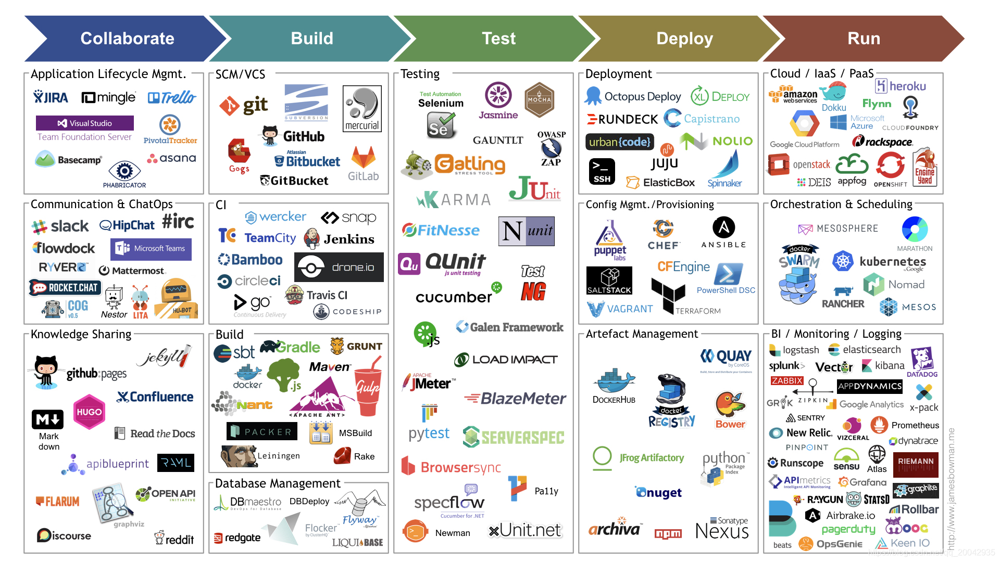

## DevOps简介

DevOps 是 Development 和 Operations 的组合，也就是开发和运维的简写。

DevOps 是针对企业中的研发人员、运维人员和测试人员的工作理念，是他们在应用开发、代码部

署和质量测试等整条生命周期中协作和沟通的最佳实践，DevOps 强调整个组织的合作以及交付和

基础设施变更的自动化、从而实现持续集成、持续部署和持续交付。

DevOps 四大平台：代码托管(gitlab/svn)、项目管理(jira)、运维平台(腾讯蓝鲸/开源平台)、持续交付

(Jenkins/gitlab)

### CI
是指多名开发者在开发不同功能代码的过程中，可以频繁的将代码进行合并到一起并且不影响工作

1. 创建新的代码分支，而后开发人员编写代码，开发完成后将代码push到新的分支；
2. 将代码clone下来进行质量扫描 & 使用maven等工具进行代码编译，测试人员进行测试；
3. 如果测试发现问题则重复上面的步骤，没问题则将代码进行review，review通过后一般由部门leader将代码合并到主分支；

### CD
持续部署是基于某种工具或平台实现代码自动化的构建、测试和部署到线上环境以实现交付高质量的产品,持续部署在某种程度上代表了一个开发团队的更新迭代速率。

运维人员将代码以 蓝绿、灰度(金丝雀)、滚动 等方式部署到生产环境
