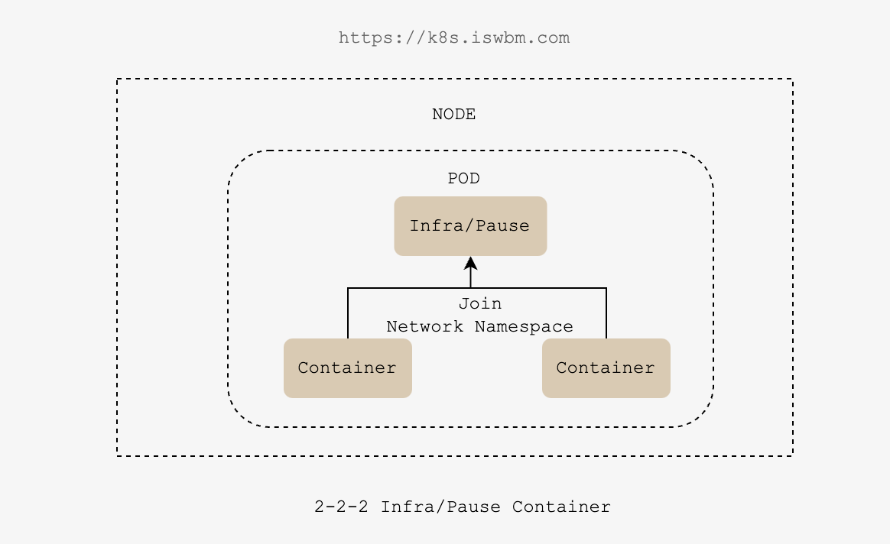

# Pod 概述

- **pod 是 k8s 中的最小单元**

- **所有的容器均在Pod中运行，一个Pod可以承载一个或者多个相关的容器**

- **一个 pod 中如果运行多个容器的话 那么这些容器是一起被调度的**

- pod 的生命周期是短暂的，不会自愈，是用完就销毁的实体

- 一般都是通过 Controller 来创建和管理 pod 的

- pod 也就是作为应用负载的组件。 

- PS：pod 翻译过来的意思就是豆荚，可以理解为豆荚中的豆粒就是一个一个的容器

- 每个 Pod 中都会运行一个 pause 容器 它是所有容器的父进程 主要负责底层网络封装

- Pod 还支持各种容器运行时，如：docker、containerd、podman等，1.24版本之前默认为docker，之后为 containerd。

- **注意：**

  - 重启 Pod 中的容器不应与重启 Pod 混淆。 Pod 不是进程，而是容器运行的环境。 在被删除之前，Pod 会一直存在。

  - 当你为 Pod 对象创建清单时，要确保所指定的 Pod 名称是合法的 [DNS 子域名](https://kubernetes.io/zh-cn/docs/concepts/overview/working-with-objects/names#dns-subdomain-names)。


在 Kubernetes 中，Pod 是最小的调度单位，是一组紧密关联的容器集合，这些容器共享同一个网络命名空间、存储卷和主机，运行在一个节点上。Pod 可以包含一个或多个容器，这些容器可以共享存储卷、网络命名空间、PID 命名空间等资源，因此可以通过本地进程间通信来协作完成一个特定的任务。

Pod 作为 Kubernetes 最小的部署单元，通常包含一个主容器和一些辅助容器（例如 sidecar 容器、init 容器等），主要用于运行一些需要协同工作的应用程序。Pod 可以由 Deployment、StatefulSet、DaemonSet 等控制器来管理，控制器会负责为 Pod 分配资源、管理 Pod 的生命周期、自动扩缩容、故障恢复等工作。

Pod 提供了一种轻量级的抽象，可以让开发人员将多个容器组合在一起，并以原子方式部署和管理它们。通过将多个容器组合在一个 Pod 中，可以让它们可以方便地共享同一个环境，从而更加轻松地构建、部署和管理应用程序。


# namespace

Linux内核中的namespace技术允许用户将一组进程隔离在一个独立的命名空间内，以提供更多的隔离性和安全性。下面是Linux内核中支持的各种namespace类型：

1. UTS namespace：隔离主机名和域名信息。
2. PID namespace：隔离进程ID空间，使得一个namespace中的进程不能看到另一个namespace中的进程。
3. Mount namespace：隔离文件系统挂载点，使得一个namespace中的进程不能访问另一个namespace中的文件系统。
4. Network namespace：隔离网络设备、IP地址、路由信息等，使得一个namespace中的进程不能访问另一个namespace中的网络资源。
5. IPC namespace：隔离命名的System V IPC对象和消息队列，使得一个namespace中的进程不能访问另一个namespace中的IPC对象。
6. User namespace：隔离用户和组ID，使得一个namespace中的进程不能看到另一个namespace中的用户和组ID。

注意：以上列举的各种namespace都是可选的，在不同的系统版本和内核配置中支持的namespace类型可能不同。


# Pod 中多个容器共享与隔离的名称空间

如果一个 Pod 中包含多个容器：
- IPC、NET、UTS 共享

- PID、MNT、USER 隔离

**pod级别的共享控制参数：**

- `ShareProcessNamespace` 默认是开启的，可以通过禁用：`--feature-gates=PodShareProcessNamespace=false`


## 范例：

```yaml
# cat many-pod.yaml
apiVersion: v1
kind: Pod
metadata:
  name: demoapp-busybox
  namespace: default
spec:
  containers:
  - name: demoapp
    image: ikubernetes/demoapp:v1.0
  - name: busybox 
    image: busybox:uclibc
    command: ["tail", "-f", "/etc/hosts"]


# kubectl apply -f many-pod.yaml 


# kubectl get pod
NAME              READY   STATUS    RESTARTS   AGE
demoapp-busybox   2/2     Running   0          3s
```

### IPC

- 共享，Pod中的多个容器能够使用SystemV IPC或POSIX消息队列进行通信；
- 所有容器共享同一个 IPC 机制，从而可以使用 SystemV IPC 和 POSIX 消息队列等方法进行通信。

- **使用 nc 工具测试：**

```sh
# kubectl exec -it demoapp-busybox -c demoapp -- sh
# 监听端口1234，作为服务端
[root@demoapp-busybox /]# nc -l 1234


# kubectl exec -it demoapp-busybox -c busybox -- sh
/ # netstat -ntl
Active Internet connections (only servers)
Proto Recv-Q Send-Q Local Address           Foreign Address         State       
tcp        0      0 0.0.0.0:80              0.0.0.0:*               LISTEN      
tcp        0      0 :::1234                 :::*                    LISTEN      
# 作为客户端并输入hello
/ # nc localhost 1234
hello

# 服务端可以收到
[root@demoapp-busybox /]# nc -l -p 1234
hello
```

- **使用 socat 工具测试：**

```sh
1
```


### NET

- Network
- 共享，所有容器共享一个网络栈，从而共享相同的 IP 地址和端口等。

```sh
# kubectl exec -it demoapp-busybox -c demoapp -- sh
[root@demoapp-busybox /]# ip a
1: lo: <LOOPBACK,UP,LOWER_UP> mtu 65536 qdisc noqueue state UNKNOWN group default qlen 1000
    link/loopback 00:00:00:00:00:00 brd 00:00:00:00:00:00
    inet 127.0.0.1/8 scope host lo
       valid_lft forever preferred_lft forever
3: eth0@if20: <BROADCAST,MULTICAST,UP,LOWER_UP> mtu 1450 qdisc noqueue state UP group default 
    link/ether 4a:82:14:bb:2a:0b brd ff:ff:ff:ff:ff:ff link-netnsid 0
    inet 10.244.1.114/24 brd 10.244.1.255 scope global eth0
       valid_lft forever preferred_lft forever
[root@demoapp-busybox /]# netstat -ntl
Active Internet connections (only servers)
Proto Recv-Q Send-Q Local Address           Foreign Address         State       
tcp        0      0 0.0.0.0:80              0.0.0.0:*               LISTEN     


# kubectl exec -it demoapp-busybox -c busybox -- sh
/ # ip a
1: lo: <LOOPBACK,UP,LOWER_UP> mtu 65536 qdisc noqueue qlen 1000
    link/loopback 00:00:00:00:00:00 brd 00:00:00:00:00:00
    inet 127.0.0.1/8 scope host lo
       valid_lft forever preferred_lft forever
3: eth0@if20: <BROADCAST,MULTICAST,UP,LOWER_UP,M-DOWN> mtu 1450 qdisc noqueue 
    link/ether 4a:82:14:bb:2a:0b brd ff:ff:ff:ff:ff:ff
    inet 10.244.1.114/24 brd 10.244.1.255 scope global eth0
       valid_lft forever preferred_lft forever
/ # netstat -ntl
Active Internet connections (only servers)
Proto Recv-Q Send-Q Local Address           Foreign Address         State       
tcp        0      0 0.0.0.0:80              0.0.0.0:*               LISTEN      


-------------
# busybox容器监听端口后
/ # nc -l -p 888

# demoapp容器中也同样能看到
[root@demoapp-busybox /]# netstat -ntl
Active Internet connections (only servers)
Proto Recv-Q Send-Q Local Address           Foreign Address         State       
tcp        0      0 0.0.0.0:80              0.0.0.0:*               LISTEN      
tcp        0      0 :::888                  :::*                    LISTEN      
```

### UTS

- 共享，Pod中的多个容器共享一个主机名；

```sh
# kubectl exec -it demoapp-busybox -c demoapp -- sh
[root@demoapp-busybox /]# hostname
demoapp-busybox
[root@demoapp-busybox /]# cat /etc/hostname 
demoapp-busybox
[root@demoapp-busybox /]# echo $PS1
[\u@\h \w]\$


# kubectl exec -it demoapp-busybox -c busybox -- sh
/ # hostname
demoapp-busybox
/ # cat /etc/hostname 
demoapp-busybox
/ # echo $PS1
\w \$
```

### PID

- 隔离，每个容器在 PID 命名空间中拥有独立的进程树，它们互相隔离。

```yaml
# kubectl exec -it demoapp-busybox -c demoapp -- sh
[root@demoapp-busybox /]# ps aux
PID   USER     TIME  COMMAND
    1 root      0:00 python3 /usr/local/bin/demo.py
    7 root      0:00 sh
   15 root      0:00 ps aux


# kubectl exec -it demoapp-busybox -c busybox -- sh
/ # ps aux
PID   USER     TIME  COMMAND
    1 root      0:00 tail -f /etc/hosts
    6 root      0:00 sh
   14 root      0:00 ps aux
```

### MNT

- Mount
- 隔离，MNT 提供磁盘挂载点和文件系统的隔离能力，但如果遇到需要收集日志等情况可以通过挂载同一个存储卷来解决，因为存储卷是不会隔离的（储存卷是Pod级别）。

```sh
# kubectl exec -it demoapp-busybox -c demoapp -- sh
[root@demoapp-busybox /]# ls -l /usr/local/bin/demo.py
-rwxr-xr-x    1 root     root          2687 Mar 21  2020 /usr/local/bin/demo.py


# kubectl exec -it demoapp-busybox -c busybox -- sh
/ # ls -l /usr/local/bin/demo.py
ls: /usr/local/bin/demo.py: No such file or directory
```

### User

- 隔离，User隔离用户和组ID，使得一个namespace中的进程不能看到另一个namespace中的用户和组ID。

```sh
# kubectl exec -it demoapp-busybox -c demoapp -- sh
[root@demoapp-busybox /]# id
uid=0(root) gid=0(root) groups=0(root),1(bin),2(daemon),3(sys),4(adm),6(disk),10(wheel),11(floppy),20(dialout),26(tape),27(video)
[root@demoapp-busybox /]# cat /etc/passwd 
root:x:0:0:root:/root:/bin/ash
bin:x:1:1:bin:/bin:/sbin/nologin
daemon:x:2:2:daemon:/sbin:/sbin/nologin
adm:x:3:4:adm:/var/adm:/sbin/nologin
lp:x:4:7:lp:/var/spool/lpd:/sbin/nologin
sync:x:5:0:sync:/sbin:/bin/sync
shutdown:x:6:0:shutdown:/sbin:/sbin/shutdown
halt:x:7:0:halt:/sbin:/sbin/halt
mail:x:8:12:mail:/var/mail:/sbin/nologin
news:x:9:13:news:/usr/lib/news:/sbin/nologin
uucp:x:10:14:uucp:/var/spool/uucppublic:/sbin/nologin
operator:x:11:0:operator:/root:/sbin/nologin
man:x:13:15:man:/usr/man:/sbin/nologin
postmaster:x:14:12:postmaster:/var/mail:/sbin/nologin
cron:x:16:16:cron:/var/spool/cron:/sbin/nologin
ftp:x:21:21::/var/lib/ftp:/sbin/nologin
sshd:x:22:22:sshd:/dev/null:/sbin/nologin
at:x:25:25:at:/var/spool/cron/atjobs:/sbin/nologin
squid:x:31:31:Squid:/var/cache/squid:/sbin/nologin
xfs:x:33:33:X Font Server:/etc/X11/fs:/sbin/nologin
games:x:35:35:games:/usr/games:/sbin/nologin
cyrus:x:85:12::/usr/cyrus:/sbin/nologin
vpopmail:x:89:89::/var/vpopmail:/sbin/nologin
ntp:x:123:123:NTP:/var/empty:/sbin/nologin
smmsp:x:209:209:smmsp:/var/spool/mqueue:/sbin/nologin
guest:x:405:100:guest:/dev/null:/sbin/nologin
nobody:x:65534:65534:nobody:/:/sbin/nologin
[root@demoapp-busybox /]# id ntp
uid=123(ntp) gid=123(ntp) groups=123(ntp)


# kubectl exec -it demoapp-busybox -c busybox -- sh
/ # ps aux
PID   USER     TIME  COMMAND
    1 root      0:00 tail -f /etc/hosts
    6 root      0:00 sh
   14 root      0:00 ps aux
/ # id
uid=0(root) gid=0(root) groups=10(wheel)
/ # cat /etc/passwd 
root:x:0:0:root:/root:/bin/sh
daemon:x:1:1:daemon:/usr/sbin:/bin/false
bin:x:2:2:bin:/bin:/bin/false
sys:x:3:3:sys:/dev:/bin/false
sync:x:4:100:sync:/bin:/bin/sync
mail:x:8:8:mail:/var/spool/mail:/bin/false
www-data:x:33:33:www-data:/var/www:/bin/false
operator:x:37:37:Operator:/var:/bin/false
nobody:x:65534:65534:nobody:/home:/bin/false
/ # id ntp
id: unknown user ntp
```


# pause 容器

- 在 Kubernetes 中，pause 容器作为 pod 中所有容器的父容器，主要负责底层网络封装



- 假设现在有一个 Pod，它包含两个容器（A 和 B），K8S 是通过让他们加入（join）另一个第三方容器的 network namespace 实现的共享，而这个第三方容器就是 pause 容器。

- 没有 pause 容器，那么 A 和 B 要共享网络，要不就是 A 加入 B 的 network namespace，要嘛就是 B 加入 A 的 network namespace， 而无论是谁加入谁，只要 network 的 owner 退出了，该 Pod 里的所有其他容器网络都会立马异常，这显然是不合理的。
- 我们在同一 Pod 里所有容器里看到的网络视图，都是完全一样的，包括网络设备、IP 地址、Mac 地址等等，因为他们其实全是同一份，而这一份都来自于 Pod 第一次创建的这个 Infra container（pause)


# 静态 Pod

- 静态 Pod 指的是无需手动创建，而是由 kubelet 自行加载创建的 Pod；
- 像 apiserver、controller-manager、scheduler、etcd 这种Pod都属于静态Pod

**以 kubeadm 方式部署集群时 Master 节点默认的静态 Pod 清单：**

```sh
# 注意！由于此目录下的文件被kubelet所监视，所以一旦kubelet发现文件有改变则会重载pod，文件时间戳修改也会触发pod重载？
root@k8s-master-1:~# ls -l /etc/kubernetes/manifests/
total 16
-rw------- 1 root root 2298 Sep 13 00:01 etcd.yaml
-rw------- 1 root root 4040 Sep 13 00:01 kube-apiserver.yaml
-rw------- 1 root root 3556 Sep 13 00:01 kube-controller-manager.yaml
-rw------- 1 root root 1476 Sep 13 00:01 kube-scheduler.yaml
```


# Pod 相关命令


**查看 Pod**

```bash
#查看pod的详细信息
kubectl get pod [-A|-n <namespaces-name>] -o wide [pod-name]

#查看pod更详细的信息
kubectl describe pod [-A|-n <namespaces-name>] [pod-name]
```

**运行 pod**

```
kubectl run net-test1 --image=busybox -- tail -f /etc/host
```

**删除 pod**

```bash
kubectl delete pod <pod_name>


#指定 NAMESPACE 并指定资源名称进行删除
kubectl delete pod -n kubernetes-dashboard dashboard-metrics-scraper-8c47d4b5d-vnjbs kubernetes-dashboard-5676d8b865-x5brm
```

**扩容 pod**

```bash
kubectl scale [--resource-version=version] [--current-replicas=count] --replicas=COUNT (-f FILENAME | TYPE NAME)
[options]
```

**获取 Pod IP**

```bash
# 传统使用 -o wide 的获取方式
# kubectl get pod -n wordpress wordpress-647f56d5c-8jwx6 -o wide 
NAME                        READY   STATUS        RESTARTS   AGE   IP            NODE         NOMINATED NODE   READINESS GATES
wordpress-647f56d5c-8jwx6   2/2     Terminating   0          21h   10.244.1.27   k8s-node-1   <none>           <none>


# 基于 go-template 方式
# kubectl get pod -n wordpress wordpress-647f56d5c-8jwx6 -o go-template={{.status.podIP}}
10.244.1.27


# 基于json方式
```


# Pod states

**Pod 的状态是由 Pod 中的容器状态（container states）共同决定的，而不是单个容器的状态**。如果 Pod 中的任何容器出现错误，Pod 的状态将被设置为 Failed。相反，如果所有容器都运行正常，则 Pod 的状态为 Running。此外，Pending 状态可能是由于调度问题（如节点资源不足），因此它不仅仅是一个阶段，而是一个状态。

在 Kubernetes 中，Pod 是一组紧密关联的容器的集合，可以使用不同的状态来表示它们的运行情况。下面是不同状态的含义：

- **Running**（运行中）：Pod 中的所有容器都已经启动并且正常运行。
- **Pending**（挂起）：Pod 已经被 Kubernetes 接受，但是它包含的容器还没有被调度到节点上运行。通常这是因为节点资源不足或者调度器还没有找到适合的节点。
- **Succeeded**（成功）：Pod 中所有的容器已经成功地完成了它们的任务并且退出了。在成功结束后，Pod 不会自动重启。
- **Failed**（失败）：Pod 中的至少一个容器已经退出并且处于错误状态。在这种情况下，Pod 可能会被重启或者删除，具体取决于 Pod 的重启策略。
- **Unknown**（未知）：表示 Kubernetes 无法获取 Pod 的状态信息，这通常是由于与 Kubernetes 相关的组件（如 API 服务器）出现故障造成的。
- **Unschedulable**（无法调度）：Pod 不能被调度，kube-scheduler 没有匹配到合适的 node 节点。Pod 无法被 Kubernetes 调度到任何节点上运行。这可能是因为没有可用的节点、节点资源不足或者 Pod 调度限制等原因。
  - PS：处于此状态重点排查 node节点CPU、内存等资源是否不足、定义的标签是否匹配、节点污点、Pod容忍度等
- **PodScheduled**（已调度）：Pod 已经被 Kubernetes 调度到节点上运行，但是容器尚未启动。
- **ContainerCreating**（容器创建中）：表示 Pod 中的容器正在创建中。
- **Initialized**（已初始化）：Pod 中的所有容器都已经初始化完成并且被创建，但是它们还没有被 Kubernetes 设置为运行状态。
- **ImagePullBackoff**（拉取镜像失败）：Pod 中的一个或多个容器无法拉取镜像，可能是因为镜像不存在、网络故障等原因。
  - PS：处于此状态重点排查 镜像是否指向正确、harbor等镜像服务器是否工作正常 是否为公开权限等
- **Ready**（就绪）：Pod 中的所有容器已经被设置为运行状态，就绪探针探测成功，并且可以接收流量。
- **CrashLoopBackOff**（崩溃循环）：Pod 中的容器已经崩溃并且正在重启。如果容器在短时间内崩溃多次，就会出现这种情况。
  - Pod中的容器发生CrashLoopBackOff错误时，Kubernetes将尝试重启该容器。如果在启动容器后，容器在很短的时间内（默认为5秒）再次发生崩溃，那么Kubernetes会认为这是一个循环崩溃，即CrashLoopBackOff错误。在这种情况下，Kubernetes会停止对该容器的重试，并将该容器的状态设置为“Error”或“CrashLoopBackOff”。
  - 如果在一段时间内（默认为10分钟）重试该容器仍然失败，则Kubernetes将停止对该容器的重试，并将该Pod的状态设置为“Failed”。此时，可以通过查看该Pod的事件或日志来了解Pod失败的原因，并进行必要的修复。
- **Failure**（失败）：如果一个Pod在启动时出现了CrashLoopBackOff错误并且重试了多次后仍然无法启动，并且已经达到了重试限制。则该Pod将被标记为“Failed”状态。
  - PS：初始延迟之前的就绪态的状态值默认为 `Failure`
- **Error**（错误）：Pod 在创建或者更新时出现错误。
- **Terminating**（终止中）：Pod 正在被终止，可能是因为达到了重启次数限制或者用户手动删除 Pod。


# Pod phase

参考文档：https://kubernetes.io/zh-cn/docs/concepts/workloads/pods/pod-lifecycle/

Pod 的 phase 表示 Pod 的生命周期阶段，不同于 Pod 的状态。

以下是 Pod 的不同阶段：

- **Pending**（等待中）：Pod 已经被 Kubernetes 系统接受，但是容器还没有被调度或者创建。
  - PS：处于此状态重点排查 Pod 依赖的存储是否有权限挂载、镜像是否可以下载、调度是否正常等
- **Running**（运行中）：Pod 正常运行，Pod 中的所有容器都已经启动并且正常运行。但是，如果该容器出现异常或崩溃，那么该状态**可能**仍然是 Running。
- **Succeeded**（已成功）：Pod 中所有容器都已经成功地执行完任务并退出，不再运行。
  - PS：比如说 job 这种资源执行完成后就会进入 Succeeded 状态
- **Failed**（已失败）：Pod 中至少一个容器已经出现错误并退出，或者 Pod 的 init 容器失败，并且不会被重启。
- **Unknown**（未知）：Kubernetes 系统无法获取 Pod 的状态。apiserver 无法获取 Pod 的状态，通常是因为 kubelet 与 apiserver 通信失败，进而无法将节点的信息发送给 apiserver
  - PS：处于此状态重点排查 master节点与node节点是否能进行通信、node节点 kubelet 是否运行正常等


# Pod 创建过程

1. 首先创建 Pod 的 yaml 文件信息 会发送给 API Server 并写入到 etcd 中
2. 然后 controller-manager 会 watch API Server，发现有 Pod 创建请求后，会创建一个 Pod 资源对象，然后将 pod 配置存储在 etcd，此时 pod 状态会变成 Pending 等待被调度
3. 之后 scheduler 也会 watch  API Server，发现有新增 Pod 的配置后，会根据 亲和性标签、节点资源使用率、等维度将 Pod 调度到合适的 Node 节点，然后将调度信息通过 API Server 写入 etcd 集群，此时 pod 状态会变成 scheduled Pod调度完成
4. Node 节点的 kubelet 会定期通过 API Server 向 etcd 集群发起查询
   - 调用 CRI；将创建容器的需求交给 docker  等容器运行时 创建容器
   - 调用 CNI；生成网络规则(IP、iptables 或 ipvs、等...)
   - 调用 CSI；实现存储持久化

5. Node 节点的 kubeproxy
6. 最后 Node 节点的 kubelet 将 Pod 状态、IP等信息上报 API Server；API Server 更新 etcd 中 Pod 信息，并设置 Pod 状态为running，此时Pod就已经创建完成。
7. 后期 Node 节点的 kubelet 会定期向 etcd 发起查询，查询 Pod 是否需要更新等操作


# Pod 生命周期

**从上到下表示时间轴从开始到结束：**

- **Init Containers**
  - 初始化容器，如果其中存在多个容器，则容器默认是**串行**启动的；初始化完成后会进入到 Terminated 状态之后会运行 containers
    - 假设初始化容器中有两个容器，则先运行容器一，容器一运行完毕退出后，再运行容器二，最后运行正式容器）

**以下属于 main container**

- **Containers**
  - 如果其中存在多个容器，则容器默认是**并行**启动的，即无法控制启动的先后顺序
- **Post Start Hook**
  - 启动后钩子，一般在容器启动后做一些简单的初始化工作（只有启动后钩子执行成功 容器才会变成 running 状态
- **Startup Probe**
  - 启动后执行一次
- **Readiness Probe**
  - 周期性执行
- **liveness Probe**
  - 周期性执行
- **Pre Stop Hook**
  - 停止前钩子，一般在容器停止前做一些清理操作（只有停止前钩子执行成功 容器才会正常停止）


# Pod 服务质量类别

QoS Class 代表了Pod的资源被优先满足的类别

- **Guaranteed**：
  - Pod内的**每个容器**都分别设定了CPU和Memroy资源需求和资源限制，CPU的需求与限制相等，而且Memory的需求与限制也相等； 
  - 优先满足

- **Bustable**：
  - 设置了一个限制，或设置了部分限制
  - 两者之间；

- **BestEffort**：
  - 未为任何一个容器设定任何需求或限制； 
  - 尽力满足


```yaml
# kubectl describe pod sidecar-container-demo
...
QoS Class:                   BestEffort
...
```


qosClass 表示服务质量类型（Quality of Service），这个字段是根据请求的内存和 CPU 来进行确定的。

其中包含三种类型：Guaranteed，Burstable 和 BestEffort。

其中这三种策略在由于资源不足而驱逐 Pod 时，有不同的优先级。

可以简单理解先驱逐 BestEffort，再 Burstable，最后是 Guaranteed。


```sh
# kubectl get pod demoapp-busybox -o json | jq .status.qosClass
"BestEffort"

# kubectl  get pod -n kube-system etcd-k8s-master-1 -o json | jq .status.qosClass
"Burstable"

# 如何使用jq取resources字段？
# kubectl  get pod -n kube-system etcd-k8s-master-1 -o json | jq .spec.containers[.resources]
jq: error (at <stdin>:206): Cannot index array with null

```


在Kubernetes中，QoS（Quality of Service）是一种策略，用于确保集群资源可用性并避免应用程序出现崩溃或性能问题。QoS可以根据容器的资源需求和使用情况，将容器划分为三个等级：Guaranteed、Burstable和Best Effort。

QoS Class是一个标识符，用于表示Kubernetes中容器的QoS等级。每个容器都有一个QoS Class，根据容器请求的资源（CPU、内存等）和集群中的资源使用情况来确定。QoS Class包括以下三种类型：

- Guaranteed：保证类Pod是具有最高优先级的Pod，它们被分配了容器请求的所有资源，并且不能超出这些限制。如果在资源紧张的情况下无法满足Guaranteed容器的请求，则Kubernetes会将其它QoS Class的容器终止，以确保Guaranteed容器可以正常运行。
- Burstable：可突发类Pod是允许共享节点资源的Pod，但是它们需要在节点上空闲资源不足时限制资源使用。当节点上的资源使用率增加时，这些Pod的资源分配可能会被限制。
- Best Effort：尽力而为类Pod是最不重要的Pod，它们只被分配了剩余的资源，并且在资源紧张时可能会被终止，以便给更重要的Pod腾出空间。

通过使用QoS类别，Kubernetes可以为容器提供适当的资源，并避免资源紧张的情况下容器运行失败。


# Pod 中容器的设计模式

在 Kubernetes 中，Sidecar、Adapter 和 Ambassador 是常用的容器设计模式，用于在容器化的微服务架构中解决通信和管理方面的问题。

除了 Sidecar、Adapter 和 Ambassador 之外，还有其他常用的容器设计模式，例如：Batch Job、Daemon Set、Daemon Set、Operator 等

## Sidecar

在 Kubernetes 中，Sidecar 模式是指将辅助容器（Sidecar 容器）与应用程序主容器共同部署在同一个 Pod 中。Sidecar 容器为主应用容器提供支持，例如负责日志收集、监控、服务发现和安全等功能。在 Sidecar 模式中，多个容器共享 Pod 的网络命名空间，使得容器之间的通信更加高效。


## Adapter

在 Kubernetes 中，Adapter 模式可以使用 Istio 这样的 Service Mesh 技术来实现。Adapter 用于在 Kubernetes 中解决应用程序中使用不同的 API 和协议的问题。例如，Adapter 可以将 gRPC 协议转换为 HTTP/1.1 协议，或者将 RESTful API 转换为 gRPC 协议。这样就能够使使用不同 API 和协议的服务之间进行通信。


## Ambassador

在 Kubernetes 中，Ambassador 模式是指通过使用 Envoy 代理作为网络入口，将所有传入和传出的网络流量引导到对应的服务。Ambassador 模式可以用于实现服务发现、负载均衡、安全和流量控制等功能。Ambassador 通常作为一个单独的容器部署在 Kubernetes 中。


## Batch Job

Batch Job 模式用于运行定期执行的批处理任务，例如数据清理、数据导入、数据导出等。


## Daemon Set

Daemon Set 模式用于在 Kubernetes 集群中的所有节点上运行一个特定的容器。


## Stateful Set

Stateful Set 模式用于管理有状态的应用程序，例如数据库。


## Operator

Operator 模式使用自定义资源定义（CRD）来扩展 Kubernetes API，用于管理和自动化特定类型的应用程序。


# Pod 日志采集方案

**方案1**

- 将 filebeat 打入基础镜像，制作子镜像时通过 ADD 配置文件的方式指定输入输出

**方案2**

- 以 DaemonSet 的方式运行 filebeat


# 节点运行 Pod 数量限制

## 通过修改调度器配置实现

以下方法可以在所有支持 Kubernetes 调度器的版本中使用，包括 Kubernetes 1.0+ 的版本。不过在不同版本中可能会有一些语法和 API 的差异，需要根据具体版本的文档进行调整。另外，不同的调度器可能会有一些限制或特殊行为，也需要参考相应的文档来了解。

在 Kubernetes 中，可以通过 Kubernetes 调度器中的 `PodTopologizer` 特性来限制每个节点上运行的 Pod 数量。这个特性是默认开启的，可以通过调整 `PodTopologizer` 的参数来改变节点上 Pod 数量的限制。具体来说，可以设置以下参数：

- `kubernetes.io/limit-pods`：该标签可以用于指定节点上可以运行的最大 Pod 数量。该标签的值必须是一个正整数，表示节点上可以运行的最大 Pod 数量。
- `kubernetes.io/num-cpus`：该标签可以用于指定节点上的 CPU 核心数。该标签的值必须是一个正整数，表示节点上的 CPU 核心数。该标签通常用于配合 `PodTopologizer` 特性，用于控制每个节点上运行的 Pod 数量。

在使用 `PodTopologizer` 特性时，需要在调度器配置文件中设置相关参数。可以通过修改 `/etc/kubernetes/manifests/kube-scheduler.yaml` 文件来进行配置，如下所示：

```yaml
apiVersion: v1
kind: Pod
metadata:
  creationTimestamp: null
  labels:
    component: kube-scheduler
    tier: control-plane
  name: kube-scheduler
  namespace: kube-system
spec:
  containers:
  - command:
    - kube-scheduler
    - --bind-address=127.0.0.1
    - --kubeconfig=/etc/kubernetes/scheduler.conf
    - --authentication-kubeconfig=/etc/kubernetes/scheduler.conf
    - --leader-elect=true
    # --pod-topologizer-policy-config-map 参数用于指定 PodTopologizer 的配置信息所在的 ConfigMap 的名称。您需要根据自己的需求调整这个参数的值。
    - --pod-topologizer-policy-config-map=pod-topologizer-policy
    # --policy-config-file 参数用于指定 PodTopologizer 的配置信息所在的文件。您需要根据自己的需求调整这个参数的值。
    - --policy-config-file=/etc/kubernetes/scheduler-policy-config.yaml
    image: k8s.gcr.io/kube-scheduler:v1.22.2
    imagePullPolicy: IfNotPresent
    name: kube-scheduler
    resources:
      requests:
        cpu: 100m
    volumeMounts:
    - mountPath: /etc/kubernetes/scheduler.conf
      name: kubeconfig
      readOnly: true
    - mountPath: /etc/kubernetes/scheduler-policy-config.yaml
      name: scheduler-policy-config
      readOnly: true
  hostNetwork: true
  volumes:
  - hostPath:
      path: /etc/kubernetes/scheduler.conf
      type: FileOrCreate
    name: kubeconfig
  - configMap:
      name: pod-topologizer-policy
    name: pod-topologizer-policy
  - hostPath:
      path: /etc/kubernetes/scheduler-policy-config.yaml
      type: FileOrCreate
    name: scheduler-policy-config
```

### 1

如果您使用的是 Kubernetes 1.18 及以上版本，可以考虑使用 TopologySpreadConstraints 来限制 Pod 在集群中的分布情况，从而避免 Pod 在某些节点上过度集中。这些策略都可以在 Kubernetes 的调度器中配置和使用。


## 通过修改kubelet的参数实现

**注意：**

- `--max-pods` 参数是 kubelet 的一个参数，因此它可以在任何支持 kubelet 的 Kubernetes 版本中使用。但是，需要注意的是，kubelet 的参数在每个节点上进行设置，因此如果要限制所有节点上的 Pod 数量，需要在每个节点上都设置一遍。
- 需要注意的是，从 Kubernetes 1.17 开始，Kubernetes 已经将 --max-pods 选项从 kubelet 中删除，而改为使用 ResourceQuota 对 Pod 资源的配额限制。建议使用 ResourceQuota 来限制每个节点上可运行的 Pod 数量。


通过 kubelet 的 `--max-pods` 参数来限制每个节点上可运行的 Pod 数量。这个参数用于限制 kubelet 可以运行的最大 Pod 数量，如果超过了这个数量，kubelet 将拒绝调度更多的 Pod，直到其他 Pod 终止并释放资源。

需要注意的是，这个参数并不会自动计算当前节点的资源使用情况或者根据节点的硬件规格进行自适应调整。因此，在使用这个参数时，需要根据节点的实际情况进行手动配置，确保不会影响其他运行中的应用。

需要注意的是，使用 `--max-pods` 参数限制节点上的 Pod 数量可能会影响调度器的性能和可靠性。当节点上的 Pod 数量达到限制时，调度器可能会出现无法调度的情况，因为没有足够的资源可用。为了避免这种情况，可以考虑使用其他方法，例如使用节点污点来限制 Pod 的调度，或者使用 Kubernetes 的自动伸缩功能来动态调整节点数量和资源使用率。

在每个节点上设置 kubelet 的 `--max-pods` 参数来限制每个节点可运行的 Pod 数量。例如：

```sh
# 限制该节点上最多运行 10 个 Pod
kubelet --max-pods=10
```


## ResourceQuota

ResourceQuota 限制的是每个 namespace 中的资源使用情况，而不是每个节点上的资源使用情况。

因此 ResourceQuota 无法实现节点运行 Pod 数量的限制


# Pod DNS

- https://blog.csdn.net/GaoChuang_/article/details/121341927


## Label & Annotation
# Label 概述

https://kubernetes.io/zh-cn/docs/concepts/overview/working-with-objects/labels/

- Label 是 Kubernetes 系统中的一个核心概念。
- Label 以 key/value 键值对的形式附加到各种对象上，如Pod、Service、RC、Node等。
- Label 定义了这些对象的可识别属性，用来对它们进行管理和选择。Label 可以在创建时附加到对象上，也可以在对象创建后通过API进行管理。
- 主要是便于管理，如xxx业务的pod，xxx业务对应的service，打上标签和相应的选择便于管理


# Label 组成

- 完整的 Label 由 键前缀+键名+键值组成，键前缀为可选部分。
  - `keyprefix/key: value`

## 键前缀

- 键前缀必须为DNS子域名格式，且不能超过253个字符，省略键前缀时，键将被视为用户的私有数据；
- 那些由Kubernetes系统组件或第三方组件自动为用户资源添加的键必须使用键前缀；
- kubernetes.io/ 和 k8s.io/ 前缀预留给了kubernetes的核心组件使用；
  - 例如 Node 对象上常用的：
    - kubernetes.io/os
    - kubernetes.io/arch
    - kubernetes.io/hostname 等

## 键名

- 键名最多能使用63个字符，支持字母、数字、连接号（-）、下划线（_）、点号（.）等字符，且只能以字母或数字开头。


## 键值

- 标签的键值必须不能多于63个字符，它要么为空，要么是以字母或数字开头及结尾，且中间仅使用了字母、数字、连接号（-）、下划线（_）或点号（.）等字符的数据。


# Label 定义参考

标签分类是可以自定义的，但是为了能使他人可以达到**一目了然**的效果，一般会使用以下一些分类：

## 版本类标签（release）

```yaml
# 稳定版
"release" : "stable"

# 金丝雀版本，可以将其称之为测试版中的测试版
"release" : "canary"

# 内测版
"release" : "alpha"

# 公测版
"release" : "beta"
```


## 环境类标签（environment）

```yaml
# 开发
"environment" : "dev"

# 测试
"environment" : "qa"

# 生产
"environment" : "prod"

# 运维
"environment" : "op"。
```


## 应用类（app）

```yaml
"app" : "ui"

"app" : "as"

"app" : "pc"

"app" : "sc"。
```


## 架构类（tier）

```yaml
# 前端
"tier" : "frontend"

# 后端
"tier" : "backend"

# 缓存
"tier" : "cache"
```


## 分区标签（partition）

```yaml
# 客户A
"partition" : "customerA"

# 客户B
"partition" : "customerB"。
```


## 品控级别（Track）

```yaml
# 每天
"track" : "daily"

# 每周
"track" : "weekly"。
```


# Label 管理命令

## 添加

```sh
kubectl label pod label-pod abc=123 # 给名为label-pod的pod添加标签

kubectl label nodes node01 disk=ssd # 给node01节点添加disk标签 
```

## 查看

```bash
kubectl get pod --show-labels # 查看pod，并且显示标签内容

kubectl get pod -l env,tier # 只显示符合键值资源对象的pod
```

## 修改

```sh
kubectl label pod label-pod abc=456 --overwrite # 修改名为label-pod这个pod上的标签 

kubectl label nodes node01 disk=sss -overwrite # 修改节点node01的标签 
```

## 删除

```sh
kubectl label pod label-pod abc- # 删除label-pod这个pod上的键为abc的标签

kubectl label nodes node01 disk- # 删除节点node01的disk标签
```


# ---


# Label Selector 概述

- Label Selector 标签选择器，通过查询条件来匹配相应的标签
- 在为对象定义好Label后，其他对象就可以使用Label Selector（选择器）来定义其作用的对象了

**注意事项：**

- 在使用时还可以将多个Label进行组合来选择
- **同时指定多个选择器时需要以逗号将其分隔，各选择器之间遵循"与"逻辑，即必须要满足所有条件**
- 空值的选择器将不选择任何对象


# Label Selector 类型

Kubernetes API目前支持两种类型的标签选择器：

- 基于等值关系 equality-based
- 基于集合关系 set-based


## equality-based

- **=** 或 **==**  都表示"等值"关系
- **!=** 表示"不等"

### example

```yaml
# 选择所有包含Label中，key等于"name" 并且 value等于"redis-slave" 的对象
name = redis-slave
name == redis-slave


# 选择所有包括Label中，key等于"env" 并且 value不等于"production" 的对象
env != production
env !== production
```


## set-based

KEY：所有存在此键名标签的资源；!KEY：所有不存在此键名标签的资源。

- **KEY in (VALUE1, VALUE2, …)**  
  - 指定的键名的值存在于给定的列表中即满足条件；
  - 在这个集合中
- **KEY not in (VALUE1, VALUE2, …)** 
  - 指定的键名的值不存在于给定列表中即满足条件；
  - 不在这个集合中
- **KEY exists (VALUE1, VALUE2, …)**  
  - 要么全在这个集合中
- **KEY not exists (VALUE1, VALUE2, …)** 
  - 要么都不在这个集合中

### example

```yaml
# 选择所有包含Label中 key等于"name" 并且 value 等于 "redis-master" 或 "redis-slave" 的对象
name in (redis-master, redis-slave)


# 选择所有包含Label中 key等于"name" 并且 value不等于"php-frontend" 的对象
name not in (php-frontend)


# 下面两行写法是否正确？
# key、operator、values 这三个字段是固定的
{key: name,operator: In,values: [zhangsan,lisi]}
# 如果指定为exists，那么values的值一定要为空
{key: age,operator: Exists,values:}
```


## equality-based + set-based

- 在某些对象需要对另一些对象进行选择时，可以将多个Label Selector进行组合，使用逗号","进行分隔即可，基于等式的LabelSelector和基于集合的Label Selector可以任意组合。

```yaml
...
selector: 
  matchLabels:
    name=redis-slave,env!=production
  matchExpressions:
    name not in (php-frontend),env!=production
...
```


# Label Selector Other

- 在使用基于集合的标签选择器同时指定多个选择器之间的逻辑关系为“与”操作
  - 比如：- {key:name,operator: In,values: [zhangsan,lisi]} ，那么只要拥有这两个值的资源，都会被选中
- 使用空值的标签选择器，意味着每个资源对象都被选中
  - 比如：标签选择器的键是“A”，两个资源对象同时拥有A这个键，但是值不一样，这种情况下，如果使用空值的标签选择器，那么将同时选中这两个资源对象
- 空的标签选择器（就是键值都为空），将无法选择出任何资源；
- 在基于集合的选择器中，使用“In”或者“Notin”操作时，其values可以为空，但是如果为空，这个标签选择器，就没有任何意义了。


# ---


# Annotation

https://kubernetes.io/zh-cn/docs/concepts/overview/working-with-objects/annotations/

http://kubernetes.io/docs/user-guide/annotations

- Annotation 可以用于定义注解，也可以用于定义服务的配置参数

- 资源注解是一个非结构化的键值映射，存储在一个可以由外部工具设置以存储和检索任意元数据。他们**不可查询**，应在修改对象时保留

- annotation的名称遵循类似于labels的名称命名格式，但其数据长度不受限制；
- 它不能用于被标签选择器作为筛选条件；但常用于为那些仍处于Beta阶段的应用程序提供临时的配置接口；
- **管理命令：**
  - 添加注解：`kubectl annotate TYPE/NAME KEY=VALUE`
  - 删除注解：` kubectl annotate TYPE/NAME KEY-`

```yaml
# 专用于ServiceAccount的相关的token信息的Secret资源会使用资源注解来保存其使用场景。
kind: Secret
metadata:
  annotations:
    kubernetes.io/service-account.name: node-controller
    kubernetes.io/service-account.uid: b9f7e593-3e49-411c-87e2-dbd7ed9749c0
```
